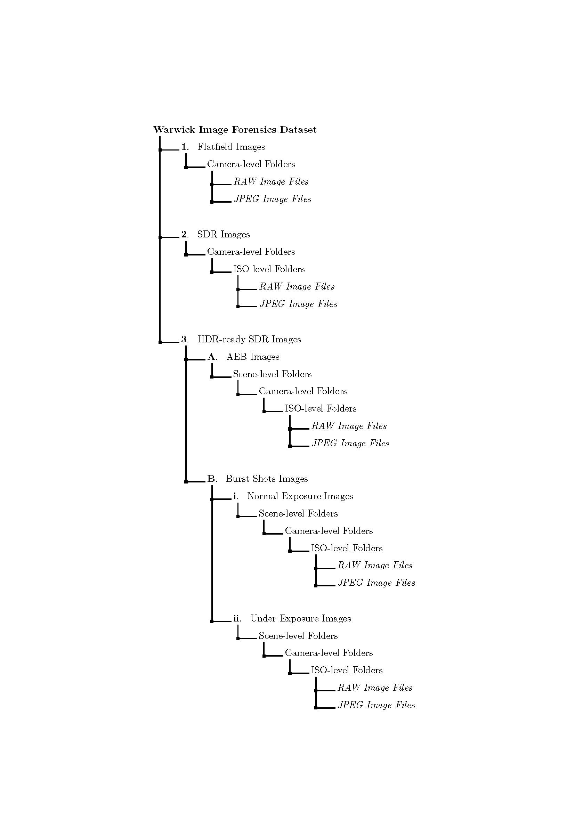

# WIFD (Warwick Image Forensics Dataset)
WIFD is a dataset dedicated for image source device fingprinting analysis. The collection of images are from 14 different cameras and the images are taken with special considerations on camera exposure parameter settings (ISO speed, exposure time and aperture size). The collection of the images can be used to study the different parameters' impact and the influence from multi-image merging algorithms' influence on source device fingerprinting.

For a more detailed descrpition of the dataset, please have a look at our recent paper:. The paper is accepted to International Conference on Multimedia and Expo 2020. The conference version of the paper will be uploaded once it is available.

To use this dataset, please cite this paper.

The folder structure of the dataset is shown below:

The JPEG images will be soon downloadable from https://www.dcs.warwick.ac.uk/dfdata/ (by the end of May, 2020)!

Due to size of the RAW images, it is infeasible to download the images. For the use of RAW images, please contact Yijun Quan: Y.Quan@warwick.ac.uk
